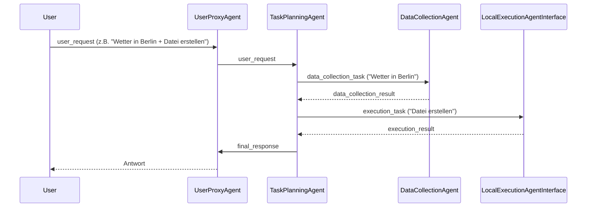
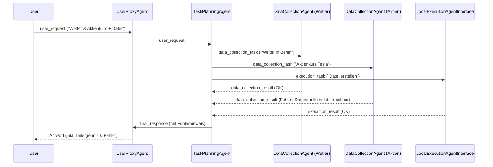

# Architektur und Ablauf: Agenten-Framework

## Übersicht

Das Framework besteht aus vier Hauptrollen (Agenten):

| Rolle                      | Aufgabe                                                        | Status         | Speicherort/Datei                                      |
|----------------------------|----------------------------------------------------------------|----------------|--------------------------------------------------------|
| **UserProxyAgent**         | Nimmt Benutzeranfragen entgegen, gibt finale Antworten aus      | Ausstehend     | (geplant: `/src/agent_framework/roles/user_proxy_agent.py`) |
| **TaskPlanningAgent**      | Zerlegt Anfragen, delegiert Teilaufgaben an spezialisierte Agenten | Ausstehend     | (geplant: `/src/agent_framework/roles/task_planning_agent.py`) |
| **DataCollectionAgent**    | Simuliert Datensammlung (z.B. Wetter, Aktienkurse)              | Ausstehend     | (geplant: `/src/agent_framework/roles/data_collection_agent.py`) |
| **LocalExecutionAgentInterface** | Simuliert Ausführung von Code/Systembefehlen (Dateien, Skripte, Shell) | **Implementiert** | [`local_execution_agent_interface.py`](../src/agent_framework/roles/local_execution_agent_interface.py) |

## Nachrichtenfluss (Standard-Workflow)

### Beispiel-Workflow (Textuell)

1. **UserProxyAgent** erhält eine Anfrage vom Nutzer (z.B. "Wetter in Berlin + Datei erstellen").
2. **TaskPlanningAgent** zerlegt die Anfrage in Teilaufgaben:
    - Datenabfrage (an DataCollectionAgent)
    - Dateierstellung (an LocalExecutionAgentInterface)
3. Ergebnisse werden gesammelt, zusammengeführt und als finale Antwort an den Nutzer zurückgegeben.

### Erweiterte Workflows (Diagramm: Parallele Datenabfragen & Fehlerfall)

**Ablaufdiagramm (PNG):**

**Beschreibung:**
- Der Planner delegiert mehrere Datenabfragen und eine Ausführungsaufgabe parallel.
- Ein DataCollectionAgent liefert einen Fehler zurück (z.B. Datenquelle nicht erreichbar).
- Die finale Antwort enthält sowohl erfolgreiche als auch fehlerhafte Teilergebnisse.

## Beispiel-Nachrichtenformate

- Siehe [`/src/agent_framework/message_examples/`](../src/agent_framework/message_examples/) für JSON-Beispiele:
  - [`user_request_example.json`](../src/agent_framework/message_examples/user_request_example.json)
  - [`planning_delegation_data_example.json`](../src/agent_framework/message_examples/planning_delegation_data_example.json)
  - [`planning_delegation_exec_example.json`](../src/agent_framework/message_examples/planning_delegation_exec_example.json)
  - [`data_collection_result_example.json`](../src/agent_framework/message_examples/data_collection_result_example.json)
  - [`execution_result_example.json`](../src/agent_framework/message_examples/execution_result_example.json)
  - [`final_response_example.json`](../src/agent_framework/message_examples/final_response_example.json)

Weitere relevante Dateien:
- [`run_simulation.py`](../src/agent_framework/run_simulation.py): Zeigt das Zusammenspiel der Agenten (Simulation)
- [`base_agent.py`](../src/agent_framework/core/base_agent.py): Basisklasse für alle Agenten

## Hinweise zur Implementierung

- Die Rollen **UserProxyAgent**, **TaskPlanningAgent**, **DataCollectionAgent** sind aktuell **noch nicht implementiert** (nur als Platzhalter im Simulation-Skript und in den Beispielen).
- Die Rolle **LocalExecutionAgentInterface** ist vollständig simuliert und dokumentiert.
- Die Simulation ([`run_simulation.py`](../src/agent_framework/run_simulation.py)) zeigt, wie die Agenten zusammenarbeiten sollen.

## ToDo (Auszug, siehe auch [`/tasks/TODO.md`](../tasks/TODO.md))
- Implementierung der fehlenden Agentenrollen (UserProxyAgent, TaskPlanningAgent, DataCollectionAgent)
- Weitere Beispiel-Workflows, Ablauf- und Fehlerdiagramme ergänzen
- README und Quickstart mit Screenshots und Beispielabläufen erweitern
- Testabdeckung für alle Rollen sicherstellen
- Doku und Diagramme laufend erweitern

---

*Letztes Update: 2025-06-30*
